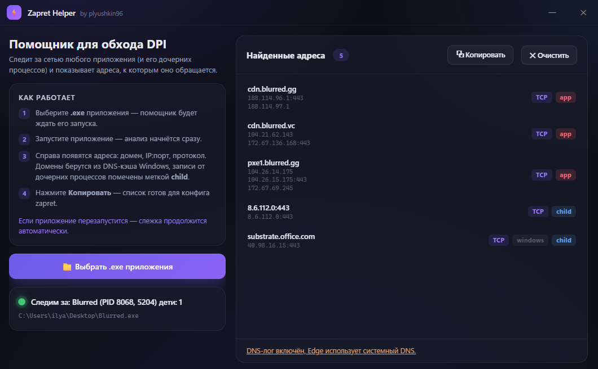

# Zapret Helper

Готовый список хостов для обхода DPI-блокировок через [zapret](https://github.com/bol-van/zapret).

Нажмите «Копировать» — чистый столбик доменов для `list-general.txt`
или любого другого list-файла zapret.

Работает с любыми приложениями: игры, лаунчеры, браузерные оболочки
(WebView2, Electron, CEF, Saucer), мессенджеры.

## Как пользоваться

1. **Запустите `Zapret-Helper.exe`**
2. Нажмите «Выбрать .exe» и укажите приложение, за которым будем следить
3. **Только теперь запустите само приложение** — чтобы не потерять ни одного подключения
4. Справа появятся адреса (домены, IP:порт)
5. Нажмите «Копировать» — готово для zapret

Если приложение перезапустится — слежка продолжится автоматически, даже за дочерними процессами.

При первом запуске нажмите «Настроить DNS» и подтвердите UAC — имена хостов будут определяться сразу.



## Возможности

- **Любое приложение** — укажите .exe, всё остальное автоматически
- **Имена хостов из DNS** — системный кэш + журнал DNS-клиента → домены вместо IP
- **Дочерние процессы** — BFS по дереву процессов, даже если родитель закрылся
- **Автокатегоризация**:
  - `app` — серверы самого приложения (сверху, красный)
  - `windows` — системный шум (телеметрия, Edge, Google DNS) — серым внизу
- **Группировка** — одинаковые имена с разными IP → одна строка, IP под именем
- **Копирование** — только домены приложения, без мусора
- **Автонастройка DNS** — одно нажатие + UAC
- **Без прав администратора** (только UAC для настройки DNS-лога)

## Как работает

| Механизм | Что делает |
| TCP-таблица | `GetTcpRow` → все TCPv4/v6 подключения, фильтр по PID |
| DNS-кэш | `DnsGetCacheDataTable` (dnsapi.dll) — системный кэш DNS |
| DNS-журнал | `Microsoft-Windows-DNS-Client/Operational` — захват ВСЕХ DNS-запросов |
| PTR | Асинхронные обратные DNS-запросы для неопознанных IP |
| Дерево процессов | `NtQueryInformationProcess` → parent PID → BFS потомков |
| Категоризация | Имя приложения в домене = `app`, известный шум = `windows` |

## Сборка

```powershell
csc /target:winexe /out:Zapret-Helper.exe `
  /reference:"WPF\WindowsBase.dll" `
  /reference:"WPF\PresentationCore.dll" `
  /reference:"WPF\PresentationFramework.dll" `
  /reference:"System.Xaml.dll" `
  /reference:"Microsoft.Web.WebView2.Core.dll" `
  /reference:"Microsoft.Web.WebView2.Wpf.dll" `
  /reference:"System.Web.Extensions.dll" `
  /resource:"index.html","ZapretHelper.index.html" `
  AppMain.cs
```

Требуется .NET Framework 4.x и [WebView2 SDK](https://www.nuget.org/packages/Microsoft.Web.WebView2).

## Флаги

| Флаг | Назначение |
|---|---|
| `-Debug` | Писать `debug.log` |
| `-Test <exe> <sec>` | Автовыбор .exe и тест N секунд |
| `-SmokeTest` | Проверка WebView2 + JS-мост |
| `-AutoPick` | Автонажатие «Выбрать .exe» |
| `-ClickPick` | Эмуляция клика по кнопке |

## Лицензия

MIT
